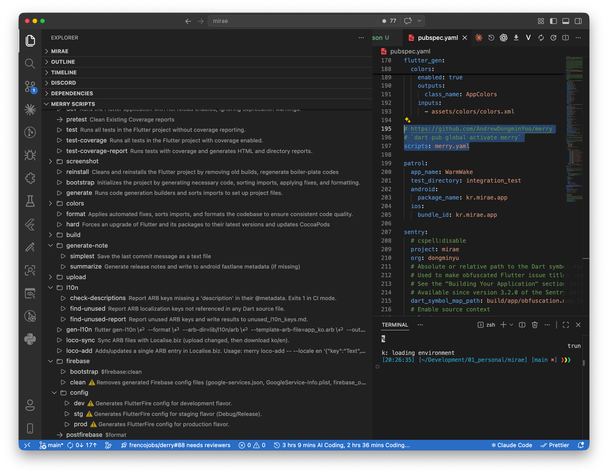
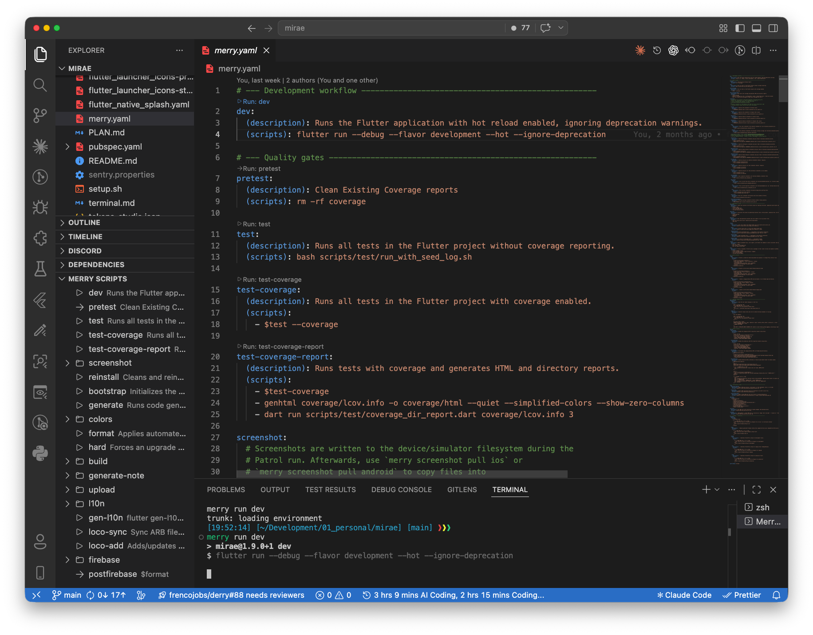
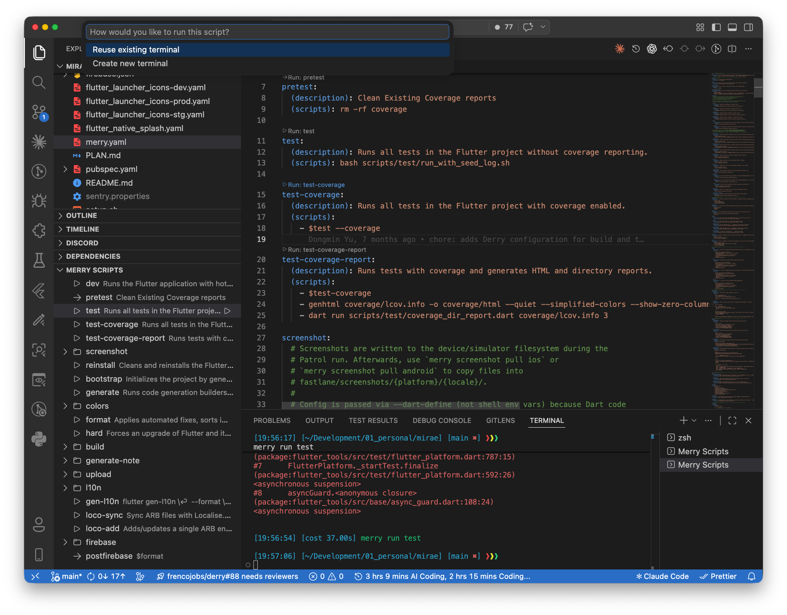
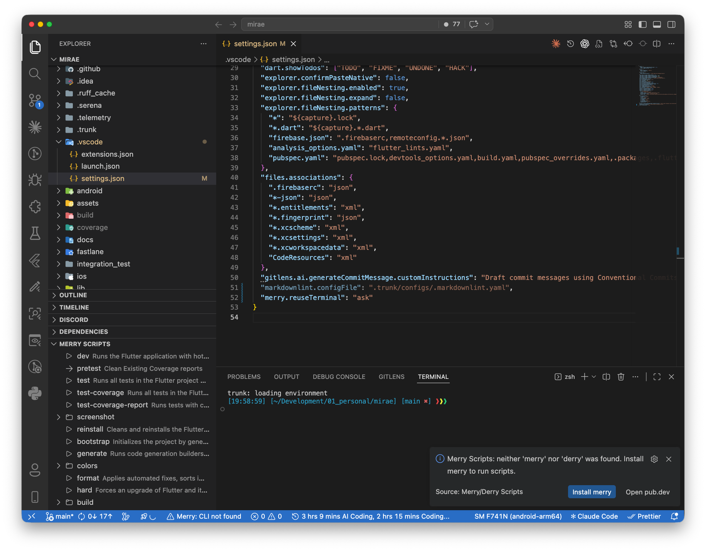
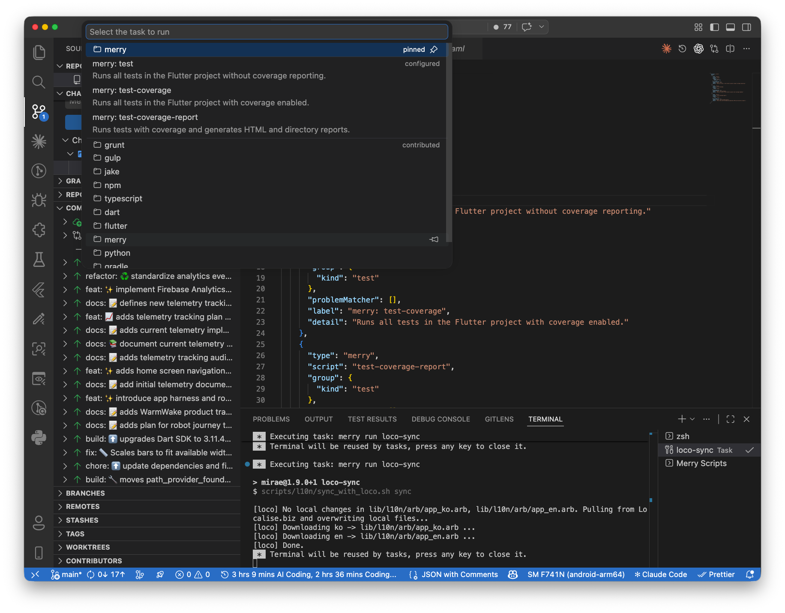

# Merry Scripts

Run `merry` and `derry` scripts from the VS Code Explorer without bouncing between YAML files and terminals.

This extension turns your Dart or Flutter script definitions into a browsable, runnable UI inside VS Code. It discovers scripts from `pubspec.yaml`, external `merry.yaml` / `derry.yaml` files, shows nested groups and hooks in the Explorer, adds run actions in the source YAML, and can expose scripts as native VS Code tasks.

## Why this extension exists

If your project already uses `merry` or `derry`, the scripts are powerful but easy to forget once the YAML grows. Merry Scripts makes those commands visible where you work every day:

- browse scripts in the Explorer
- click to run a script immediately
- inspect nested groups such as `build aab` or `firebase config prod`
- spot hook scripts like `pretest` and `posttest`
- jump back to the script source file when you need to edit it

## UI preview and screenshot plan

If you want the README to explain the UX clearly, these are the best screenshots to attach. The placeholders below are intentionally written so you can replace them with real images later without redesigning the document structure.

### 1. Explorer overview



This is the main product moment. It immediately shows that the extension is not just a command runner, but a structured script browser inside the VS Code Explorer.

### 2. YAML source with CodeLens actions



It shows that users can stay in the script source file and still run commands without switching back to the Explorer.

### 3. Terminal reuse prompt



This captures an interaction detail that makes the extension feel polished and practical during repeated runs.

### 4. Missing CLI guidance



It reassures new users that the extension explains what is wrong and gives them a direct path to fix it.

### 5. VS Code Tasks integration



This helps advanced users understand that the extension is more than a sidebar; it also plugs into native VS Code workflows.

### Screenshot capture tips

- Use a clean workspace with a realistic `merry.yaml` tree.
- Prefer one consistent theme across all screenshots.
- Keep the Explorer, editor, and terminal widths readable rather than artistic.
- For Marketplace usage, favor screenshots that explain a workflow in 2–3 seconds.
- If you only add **one** screenshot, make it the Explorer overview.

## What it supports

### Script discovery

The extension activates in workspaces that contain any of the following:

- `pubspec.yaml`
- `merry.yaml`
- `derry.yaml`

It supports both common merry/derry layouts:

1. inline `scripts:` inside `pubspec.yaml`
2. `scripts: merry.yaml` or `scripts: derry.yaml` pointing to an external file

### Explorer-based script browsing

Scripts are rendered in a dedicated **Merry Scripts** view in the Explorer.

- runnable leaf scripts use a play icon
- nested script maps become collapsible groups
- hook scripts such as `pretest` and `posttest` get distinct hook styling
- script items show their description or first command inline
- tooltips include the full script path, commands, and working directory when available

### One-click execution

You can run scripts by:

- clicking the script item directly
- using the script item's context menu
- using the `Run Script` command contributed by the extension

The extension runs scripts in the integrated terminal using:

```bash
merry run <script path>
```

If both CLIs are installed, `merry` is preferred over `derry`.

### Nested script paths

Nested scripts are preserved as space-delimited merry paths.

For example, a YAML structure like this:

```yaml
build:
  aab:
    (scripts): flutter build appbundle --release
```

is executed as:

```bash
merry run build aab
```

### Hooks and platform-dispatch nodes

- `preX` / `postX` scripts are recognized as hooks when the matching base script exists.
- platform-dispatch definitions such as `(linux)`, `(macos)`, or `(windows)` are treated as runnable leaf nodes and surfaced with CodeLens support.

### CodeLens in YAML files

When you open the script source file, the extension adds CodeLens actions such as:

- `Run: test`
- `Run: build aab`
- `Run: firebase config prod`

This works for:

- `pubspec.yaml`
- `merry.yaml`
- `derry.yaml`
- external YAML files referenced from `pubspec.yaml`

### VS Code Tasks integration

The extension also contributes a `merry` task type so runnable scripts can participate in normal VS Code task workflows.

- leaf scripts become tasks
- build-like scripts are grouped as **Build** tasks
- test hooks and test scripts are grouped as **Test** tasks
- clean-like scripts are grouped as **Clean** tasks

Example task definition:

```json
{
  "type": "merry",
  "script": "build aab"
}
```

### Auto-refresh and source awareness

The script tree refreshes when:

- `pubspec.yaml` changes
- the external `merry.yaml` / `derry.yaml` file changes

If the workspace contains `merry.yaml` or `derry.yaml` but `pubspec.yaml` does not link it through `scripts:`, the extension shows a helpful message telling you how to connect it.

### Install guidance when the CLI is missing

If neither `merry` nor `derry` is available, the extension does not try to fake execution.

Instead, it:

- shows a warning in the status bar
- offers an install prompt
- can open a terminal with the install command
- can open the `merry` package page on pub.dev

## Installation

Install the CLI first:

```bash
dart pub global activate merry
```

Then install the VS Code extension.

If you already use `derry`, the extension can detect and run it too, but `merry` remains the preferred CLI when both are installed.

## Quick start

1. Add scripts to `pubspec.yaml`, or link an external `merry.yaml` / `derry.yaml` file.
2. Open the project in VS Code.
3. Expand the **Merry Scripts** view in the Explorer.
4. Click any script to run it.
5. Use **Refresh Scripts** or **Open Script Source** from the view title when needed.

Example `pubspec.yaml`:

```yaml
name: example_app
scripts: merry.yaml
```

Example `merry.yaml`:

```yaml
pretest:
  (description): Clean old coverage output
  (scripts): rm -rf coverage

test:
  (description): Run Flutter tests with coverage
  (scripts): flutter test --coverage

build:
  apk:
    (description): Build Android APK
    (scripts): flutter build apk --release
```

## Commands

This extension contributes these commands:

- `Merry: Run Script`
- `Merry: Refresh Scripts`
- `Merry: Open Script Source`
- `Merry: Install merry CLI`

## Settings

### `merry.enable`

Enable or disable the extension.

### `merry.reuseTerminal`

Controls what happens when you run another script:

- `never`: always create a new terminal
- `always`: reuse the existing Merry terminal when possible
- `ask`: show a Quick Pick so you can choose each time

## Current scope and limitations

- Multi-root workspace behavior is not finalized yet.
- The extension focuses on discovery and execution, not script editing.
- If the CLI is missing, the extension shows install guidance instead of providing a fallback runner.

## Release notes

See [CHANGELOG.md](./CHANGELOG.md) for release history.
